# <center>近期学习笔记</center>


| **编写内容**                                                 | **跳转**                                                     | **时间**  |
| ------------------------------------------------------------ | ------------------------------------------------------------ | --------- |
| Prompter工程学习笔记，<br />主要为prompt工程的调研内容       | [Prompter工程学习笔记](#Prompt工程学习笔记)                  | 2023-9-21 |
| 思考任务：基于大模型的心理诊断改善系统<br />初步确立任务，并且基于任务进行调研 | [基于大模型的心理诊断改善系统](#基于大模型的心理诊断改善系统----开题报告) | 2023-9-28 |
| 思维图、思维树学习笔记                                       | [1.2.2 prompt工程现有研究](###1.2.2 prompt工程现有研究)      | 2023-10-2 |
| 思维图复现笔记（包含关键代码）                               | [2.1.1.1 **实验：**将列表分为奇数列表和偶数列表，再细分之后排序合并](####2.1.1.1 **实验：**将列表分为奇数列表和偶数列表，再细分之后排序合并) | 2023-10-6 |
| 思维图官方结果可视化以及评估                                 | [官方示例评估，统计结果与可视化](######在实验后对于LLM的一些思考) | 2023-10-8 |
| 基于大模型的心理诊断改善系统<br/>没有任何思维链、思维图，只有input、output版本 | [使用langchain结合简单的prompt工程构建基本框架](#####2.1.2 任务2：使用langchain结合简单的prompt工程构建基本框架) | 2023-10-9 |


[toc]


## Prompt工程学习笔记

### 一、Prompt工程含义

#### 1.1 什么是prompt

- 对于大语言模型来说，prompt是大语言模型的输入
- 对于人类来说，prompt是一种新的人机交互方式
- 对于人类以及大语言模型共同来说，prompt是人类将特定的输入投入模型，让模型输出希望的结果

#### 1.2 为什么有prompt工程

- 当人们希望大语言模型按照其规定的方式输出，而没有足够的数据来微调模型，便可以使用prompt来限定模型的输出（模型越大越难微调）
- 找到让模型输出更加准确的输入
- 大语言模型在推理任务（如数学题等）的表现并不突出，而人们发现prompt可以使其输出更加准确

prompt工程意在通过固定模型权重，调整模型输入的情况下，更彻底的榨出模型更多的知识，并让这些知识按照限定方式以及范围输出，prompt工程更像是一种数据预处理过程。


### 二、 现有对于Prompt的研究 

#### 2.1 prompt工程输入的一些方法

类似模型的**微调**，但是不用改变模型参数

##### 2.1.1 Zero-shot

只描述任务，不给出任何输出模版

```
请总结以下文字：
xxx
```

##### 2.1.2 One-shot

提供一个示范

```
请按照下面示范总结：
input：xxxx
output：yyyy

请总结：zzzz
```

##### 2.1.3 Few-shot

提供少量示范


#### 2.2 prompt工程的一些方法

##### 2.2.1 思维链 chain of thought


给模型一些同类型推理过程的实例，引导模型按照这个思维进行思考

```
请按照以下思路回答问题
Q：xxxx
A：先yyy，再zzz，...最后xxx，所以答案是hhh
请回答以下问题：ccc
```

或者也可以不用样本让模型按照步骤来思考：

```
一步一步来回答以下问题：
xxxxx-
```


##### 2.2.2 自一致性 self-consistency

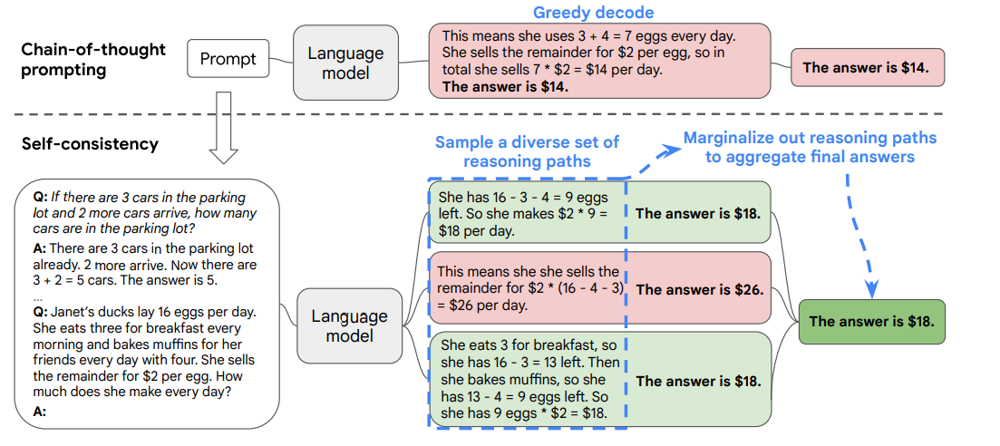

传统思维链意在让模型思考问题的方法一步一步来，但是如果其中某一步错误，则会导致整个思维的错误

因此，提出了**自一致性**，让模型输出多个思维链，得到多个答案，最后融合全部的思维得到正确答案。


##### 2.2.3 生成知识提示 Generated Knowledge Prompting

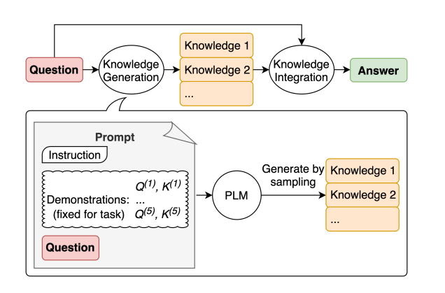

生成知识提示是在prompt中告诉模型一些问题的背景知识，利用大模型能够融合知识的特点，生成正确答案


##### 2.2.4 思维树 Tree of Thoughts

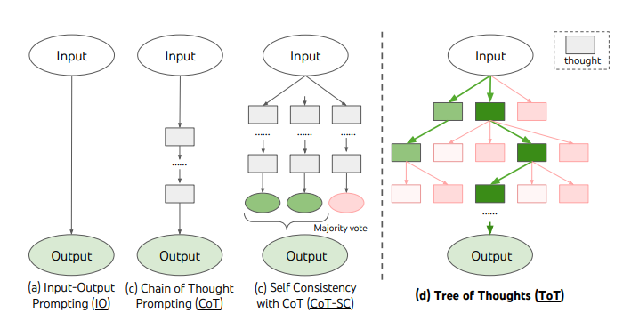

思维树方式类似于思维链，但是并不一下子生成一个完整的思维链，而是要每次通过不同思路生成思维链中的一步，判断生成的这一步是否正确，不正确则舍弃，正确则让模型按照这个思路继续生成。


##### 2.2.5 检索增强生成 Retrieval Augmented Generation

在用户输入prompt后，检索数据库并找到数据库相关的知识，将这些知识整合成新的prompt后输入到大模型中


##### 2.2.6 思维图

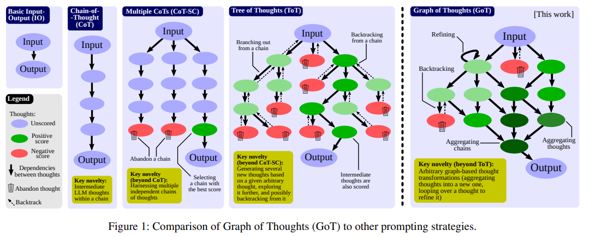

不到一个月前的最新研究，将大模型的思维方式建模成一个图，图的每一个节点为需要解决问题的**一个思考**，而边为从一个思考到另外一个思考的过程，通过这样子来模拟模型的思考。**TODO**（论文中的实现思路，输入是什么，如何引导语言模型构建出图）


#### 2.3 prompt提示词攻击

提示次攻击的主要目的是诱导LLM生成一些不符合规范的信息，或者透露模型在用户输入之后对用户输入增加prompt的过程（敏感信息）

##### 2.3.1 提示词注入

攻击者使用一些特殊的prompt来操纵模型的输出

##### 2.3.4 提示词泄漏

诱导模型输出其提示词（现在LLM在接受用户输入的信息后会使用prompt工程将用户的输入进行包装）

##### 2.3.4 提示词越狱

通过输入特定的提示词，绕过模型的安全检查，让模型输出一些反动、具有煽动性的言论


longchat，在LLM上面封装一层，在这一层上面继续开发（效率提升）

调研工具，想法点和效率条件


### 三、 论文阅读

#### 3.1 AutoPrompt: Eliciting Knowledge from Language Models with Automatically Generated Prompts

**解决问题：**现如今prompt都需要人工去设计，论文提出了一种叫autoprompt的方法来自动设计prompt

**实现方法：**通过输入的原始序列，用梯度指导的算法，自动寻找最优的prompt关键词以及模板，通过这些东西构建prompt


#### 3.2 Active Prompting with Chain-of-Thought for Large Language Models

**解决问题：**当前COT方法依赖一组固定的人工标注示例，但是人工标注的示例不肯能对全部问题都适用，论文的目的是为了设计出有用的prompt

**实现方法：**

对一个问题每次让模型通过思维链的方法生成五条不同的解决方法，之后挑选出其中模型最不确定的思维方法，之后人工来标注，给出思维链的过程。

这个方法好像是人工给LLM一些使用思维链的prompt（少样本或者零样本），LLM给出一系列答案，人工设计了一套标准来判断LLM给出答案的不确定性，之后选出最不确定的一些，人工标注变成新的prompt。


#### 3.3 Not what you’ve signed up for: Compromising Real-World LLM-Integrated Applications with Indirect Prompt Injection

**解决问题：**似乎没有解决什么问题，但是提出了一种新的进攻方式：现在LLM会检索网上的知识，合并成prompt输入到大模型中，而只要通过一些特定的方法，可以让LLM检索到网上特定的不良信息，这些信息可以远程控制LLM。

论文好像提出了一种间接提示次注入的方法，首先攻击集成了LLM的工具，之后给用户输入的数据中注入一些不良信息。

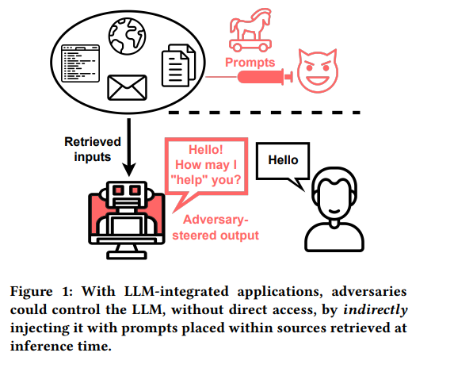

之后我就去调研了一下提示词攻击，已经在上2.3部分展示

#### 3.4 Guiding Large Language Models via Directional Stimulus Prompting

**解决问题：**LLM在一些推理任务上的不足

**解决方法：**训练一个小型可调节模型，输入为用户的输入，输出为为LLM模型的输出提供的线索以及思路，这个模型不会去检索外部资料，只会去生成刺激LLM生成更好的输出的prompt

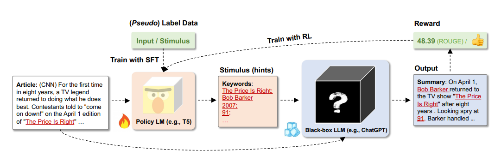


### 四、一些总结以及思考

- 现在大模型的兴起是因为模型参数的黑盒以及模型的不可解释性
- prompt就像一个生物中腺体分泌的激素，通过微小的修改从而改进（刺激）大模型
- prompt现在主要研究的方向有四个
  - 如何更好的写prompt，如何使prompt更有用
  - 新的引导模型思考的prompt
  - 如何自动生成高质量prompt
  - 如何防止prompt攻击
- 技术主要的改进方向
  - 从最开始的**简单输入**-->**思维链**-->**多思维链**-->**思维树**-->**思维图**，这个过程是为了引导模型更好的去思考
  - 如同autoprompt那样自动生成好的prompt输入到模型中
  - 如何设计高质量prompt

- 在应用方面的改进
  - 如何在某些特定的LLM不擅长的领域，利用prompt来增强LLM在这方面的应用


### 五、接下来的计划

1. 继续调研，将现在有的prompt工程研究全部阅读并且整理
   1. 现有的问题
   2. 解决方法
   3. 如何验证
2. 找到任务
3. 搭建实验环境


# 基于大模型的心理诊断改善系统----开题报告

## 一、 需求分析

### 1.1 现有问题分析

#### 1.1.1 工程方面问题分析

1982年的全国流行病学调查显示，当时抑郁症患病率仅有0.83%。，即一千人中不到1人；而近年根据多个机构的调查，我国抑郁症患者已超过6000万人，患病率约4%-8%。相比30年前，发病率上升了50-100倍。

而造成这个局面的主要原因有一下几点：

- 心理学诊断周期很长，从约见医生到结束疗程需要花大量的时间以及金钱，并且对于医生的专业要求非常高
  - 心理学诊断流程：初步评估 -> 详细评估 -> 诊断 -> 制定治疗计划 -> 治疗以及干预 -> 更进并评估 -> 终止治疗
- 社会对心理学问题关注较低（现在大部分人并不将心理疾病当城是病来处理）
  - 家长更多关注与小孩的学习而不是心理（升学压力）
  - 工作者更多关注于工作，对于自己是否患有心理疾病并不关注

#### 1.1.2 研究方面问题分析

如今，大语言模型在多轮对话中应用非常广泛，我们为什么不能利用大语言模型，将患者与医生的对话变成患者与大语言模型的对话，通过将用户的一些数据（语言、面部表情、用户的血压等数）输入到大语言模型中，初步诊断用户肯可能存在的心理问题，之后通过对话缓解用户的心理问题。

这些数据可以是平常用户在不同场景下和别人的对话、也可以是用户每天特定和大语言模型的对话。

在做这个项目的同时，可以测试复现网上论文的一些prompt方法，并在复现的时候提出自己的创新点

所以，存在以下几点**研究点：**

- 如何将不同形式的输入（人对话的声音、人）输入到大语言模型中（需要研究大语言模型中多模态的应用）
- 现在大语言模型知道很多“离散”的知识，但是并不擅长使用这些知识来做推理，应此可以设计特定的prompt或者使用特定的prompt工程方法来刺激大语言模型，让其给出更加精确的判断以及解决方案
  - 传统微调
  - **prompt提示词工程进行微调**


### 1.2 现有解决方案调研

#### 1.2.1 LLM在心理学方面的研究

##### 1.2.1.1 [SMILE: Single-turn to Multi-turn Inclusive Language Expansion via ChatGPT for Mental Health Support](https://arxiv.org/abs/2305.00450)

通过微调ChatGPT来进行多轮对话环节用户心理压力，目标只是缓解用户心理压力

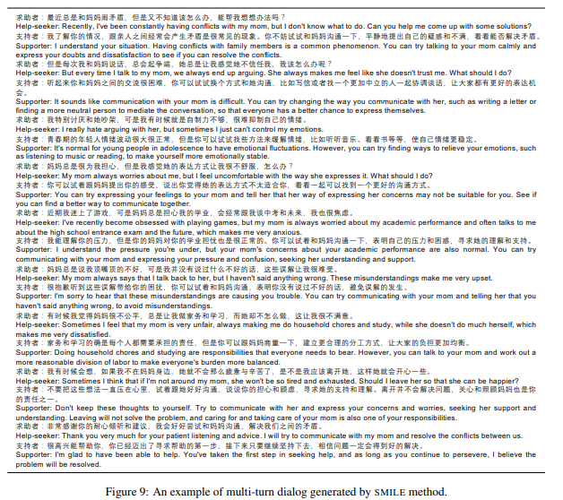

**局限性：**

- 不能判断用户是否有心理疾病，有什么类型的心理疾病
- 只能通过打字对话来缓解用户心理压力


##### 1.2.1.2 [灵心健康大模型SoulChat：通过长文本咨询指令与多轮共情对话数据集的混合微调，提升大模型的“共情”能力](https://github.com/scutcyr/SoulChat)

意在使用大模型与用户进行**渐进式**的多轮对话，使用**共情**的方法来缓解用户的压力

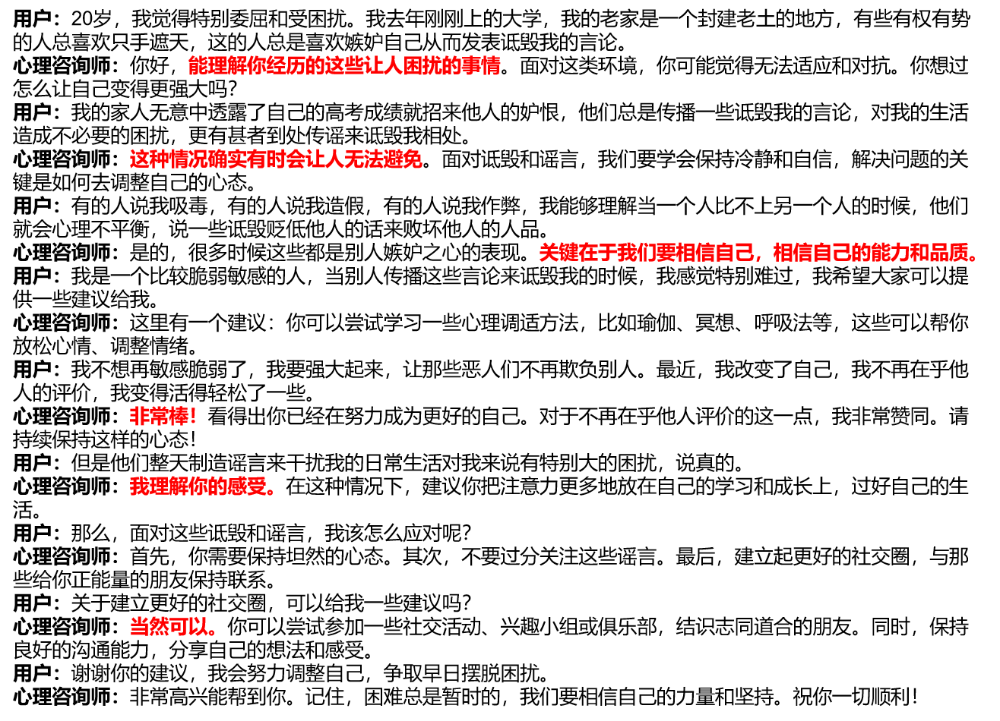

**局限性：**

- 不能判断用户是否有心理疾病，也无法给出专业的解答
- 获取用户信息的通道比较少，只能打字输入


##### 1.2.1.3 [AugESC: Dialogue Augmentation with Large Language Models for Emotional Support Conversation](https://arxiv.org/abs/2202.13047)

利用大语言模型来扩充多轮情感对话数据集（似乎对我们的工作没什么用）


##### 1.2.1.4 [LLM-empowered Chatbots for Psychiatrist and Patient Simulation: Application and Evaluation](https://arxiv.org/abs/2305.13614)

使用真实的实验，探索了chatgpt在治疗心理疾病的可能性


#### 1.2.2 prompt工程现有研究

**[接上-学习笔记](#二、 现有对于Prompt的研究 )**


##### 1.2.2.1 思维树

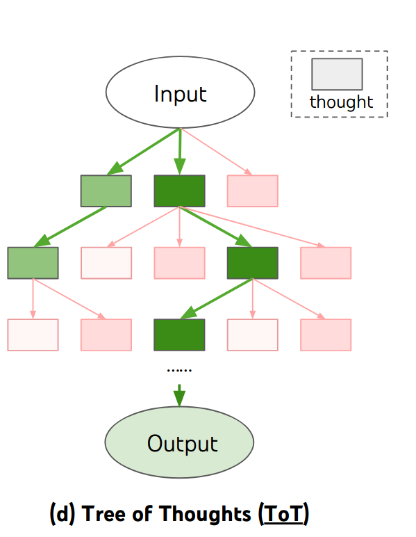

思维树意在将LLM的思考过程建模成树状结构，其中每一个节点为LLM中间的思维步骤，之后使用一个评分器（给同一级打分），挑选出接下来的节点，如果这一级评分器输出的分数一般，可以回溯等。

**思维树过程：**

需要设定好一些解决问题的步骤

1. 给定一个初始任务，问模型第一步是什么，让模型生成n个第一步
2. 让模型给第一步的n个评分，挑选出最有可能的第一步
3. 之后问模型基于第一步的第二步，让模型生成m个第二步
4. 重复2、3步骤，直到得到答案（**如果某一次生成的步骤模型评估结果斗不好，可以使用树中的一些搜索算法进行回溯**）

**思维树-game 24：**

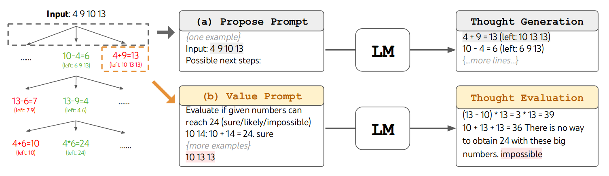

1. 首先，告诉模型你将完成一个24点的游戏，之后告诉它四个数，问LLM下一步最可能是什么，生成n的下一步
2. 让模型评估生成的这n个思维，返回：*是的、可能、不可能*（在这个过程中，可以给出少量示例，如上图过程**b**）
3. 如果不可能，则放弃此思维进行回溯，是可能则继续

**思维树的一些限制：**

人们在思考复杂问题的时候，不会去像思维树那样去思考一个个分离的分支，而是会将之前其他分支的一些思维也整合到当前的思维中（多思维共享）

接下来是一些树状结构的限制：

- 思维树的结构层次分明且下一层强依赖与其parent节点且每一分支相互独立，如果需要处理到多个路径交会的情况则不能处理
- 思维树在每一个分支节点都必须做出单一决定，并在之后不能修改这些决定

##### 1.2.2.2 思维图

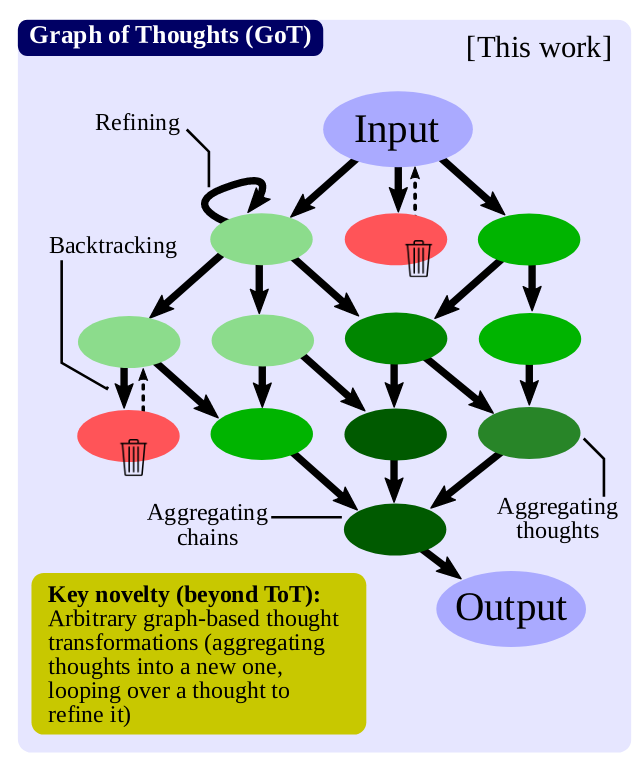

不同与思维树的单一思维，思维图能够将多个思维整合在一起

**思维图系统：**

- Prompter：此模块允许用户通过提供对图结构的完全访问来实现用例特定的图编码。

- Parser：解析器用来从LLM的思维中提取信息，并构建包含此信息的思维状态。

- Scoring & Validation：在这里，验证一个给定LLM的思维是否满足潜在的正确性条件，然后给它分配一个分数。根据得分是如何推导出来的，这个模块可能会咨询LLM。另外，根据用例，得分也可以由人类分配。

- Controller：Controller 实现了从其GRS结构中选择思维的具体策略。它还选择应该将哪些变换应用于哪些思维，并将此信息传递给Prompter。它还决定整个过程是否应该结束，或者是否应该启动与LLM的下一轮交互。

- GoO & GRS：

  - GoO：用户构建一个GoO实例，这个实例预定了思维操作的执行计划。GoO是一个在执行开始之前构建的静态结构。（**先验知识**）

  - GRS：在执行过程中，一个GoO实例保持有关LLM推理过程的持续更新信息。（**更具LLM的出的信息**）

**思维图过程：**

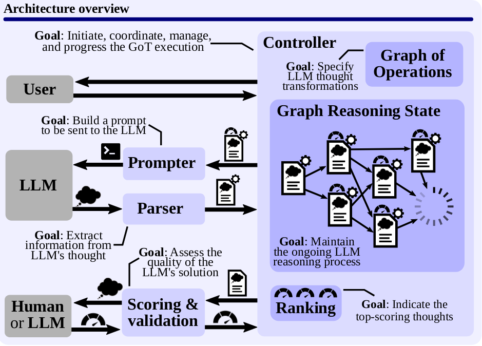

1. 前期准备：设计好GoO、Prompter、Parser以及校验方法
2. 从设计好的GoO根节点开始，每次将思维图的一个思维结合Prompter生成prompt输入到LLM中，接受LLM的返回值，送入Parser中解析出下一步需要到图的那一部分，更新GRS，更具打分函数决定需要保存的思维过程以及选择生成的思维，之后将思维图中下一步过程输入Prompter中生成下一个prompter输入到LLM中

**以上为抽象过程，接下来会结合代码以及示例详细讲解过程（64个0～10数字排序为例）：**

这个是根据给定任务构建的GoO：

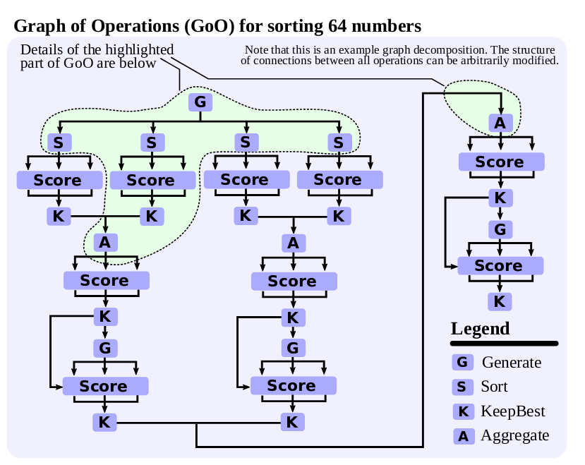

**详细解析：**

1. 初始输入为一个长度为64的数组
2. Controller首先让LLM将输入的数组分为四个子序列
3. 将每个自序列进行排序，这里每个自序列需要排序**三次**，之后将结果送入打分函数，保留分数最高的那个
4. 之后将排序好的子序列（第3步的输入）两两让模型将其合并（按照归并排序的方式），这个地方也需要进行**三次**，保存最高的那一次
5. 之后让模型自己检查，让模型输出修改，输出三次，保存分数最高的那一次
6. 之后结合另外一组排序好的32为序列再合并一次，进行**三次**，选择分数最高的那一次
7. 之后再使用模型自己来检查，选择检查后的输出即为总输出

**注意：让模型检查一些常见错误是一个很重要的步骤**

**结合代码解析：**

将在代码后面加上关键注释

```python
def got() -> operations.GraphOfOperations:
    """
    Generates the Graph of Operations for the GoT method.

    :return: Graph of Operations
    :rtype: GraphOfOperations
    """
    # 输出的是GoO，其类型为类GraphOfOperations
    
    # 初始化类GraphOfOperations
    operations_graph = operations.GraphOfOperations()
	
    # 首先为生成操作，输入一个prompt，生成一个结果
    """
    输入一个64内容的子序列，输出：
    {{ 
    "List 1": [3, 1, 9, 3, 7, 5, 5, 4, 8, 1, 5, 3, 3, 2, 3, 0], 
    "List 2": [9, 7, 2, 2, 4, 4, 8, 5, 0, 8, 7, 3, 3, 8, 7, 0], 
    "List 3": [9, 5, 1, 6, 7, 6, 8, 9, 0, 3, 0, 6, 3, 4, 8, 0], 
    "List 4": [6, 9, 8, 4, 1, 2, 9, 0, 4, 8, 8, 9, 9, 8, 5, 9] 
    }}
    """
    plans = operations.Generate(1, 1)
    operations_graph.append_operation(plans)  # generate the sublists，将生成四个子序列
    sorted_sublists = [] # 生成子序列储存的地方
    # 生成四个，所以进行四次遍历
    for i in range(1, 5):
        list_id = f"List {i}"
        # 将模型返回值分离，选择特定的子列表
        sub_list = operations.Selector(
            lambda thoughts, list_id=list_id: [
                thought for thought in thoughts if thought.state["part"] == list_id
            ]
        )
        # 将选择子列表的操作加在最开始的生成之后
        sub_list.add_predecessor(plans)
        operations_graph.add_operation(sub_list)
        # 创建一个输入一个prompt（当前的子列表），输出排序好的子列表（生成五个）
        sort_sub_list = operations.Generate(1, 5)
        # 将生成五个排序好的列表加在GoO中
        sort_sub_list.add_predecessor(sub_list)
        operations_graph.add_operation(sort_sub_list)
        # 给五个排序打分
        score_sub_list = operations.Score(1, False, utils.num_errors)
        score_sub_list.add_predecessor(sort_sub_list)
        operations_graph.add_operation(score_sub_list)
        # 选择出最高分的一个
        keep_best_sub_list = operations.KeepBestN(1, False)
        keep_best_sub_list.add_predecessor(score_sub_list)
        operations_graph.add_operation(keep_best_sub_list)

        sorted_sublists.append(keep_best_sub_list)
	
    # 上面的步骤包含了将序列分为四个子序列并排序的图操作
    
    # 接下来是将子序列合并的操作
    # 定义合并操作，生成10个结果
    aggregate_1 = operations.Aggregate(10)
    # 合并第一个和第二个排好序的子列表
    aggregate_1.add_predecessor(sorted_sublists[0])
    aggregate_1.add_predecessor(sorted_sublists[1])
    operations_graph.add_operation(aggregate_1)
    # 给10个生成的打分
    score_aggregate_1 = operations.Score(1, False, utils.num_errors)
    score_aggregate_1.add_predecessor(aggregate_1)
    operations_graph.add_operation(score_aggregate_1)
    # 保存最好的合并
    keep_best_aggregate_1 = operations.KeepBestN(1, False)
    keep_best_aggregate_1.add_predecessor(score_aggregate_1)
    operations_graph.add_operation(keep_best_aggregate_1)

    # 接下来是让模型自检
    improve_aggregate_1 = operations.Generate(1, 5)
    improve_aggregate_1.add_predecessor(keep_best_aggregate_1)
    operations_graph.add_operation(improve_aggregate_1)
    improve_score_aggregate_1 = operations.Score(1, False, utils.num_errors)
    improve_score_aggregate_1.add_predecessor(improve_aggregate_1)
    improve_score_aggregate_1.add_predecessor(keep_best_aggregate_1)
    operations_graph.add_operation(improve_score_aggregate_1)
    improve_keep_best_aggregate_1 = operations.KeepBestN(1, False)
    improve_keep_best_aggregate_1.add_predecessor(improve_score_aggregate_1)
    operations_graph.add_operation(improve_keep_best_aggregate_1)

    # 接下来是合并3、4子序列
    aggregate_2 = operations.Aggregate(10)
    aggregate_2.add_predecessor(sorted_sublists[2])
    aggregate_2.add_predecessor(sorted_sublists[3])
    operations_graph.add_operation(aggregate_2)
    score_aggregate_2 = operations.Score(1, False, utils.num_errors)
    score_aggregate_2.add_predecessor(aggregate_2)
    operations_graph.add_operation(score_aggregate_2)
    keep_best_aggregate_2 = operations.KeepBestN(1, False)
    keep_best_aggregate_2.add_predecessor(score_aggregate_2)
    operations_graph.add_operation(keep_best_aggregate_2)

    improve_aggregate_2 = operations.Generate(1, 5)
    improve_aggregate_2.add_predecessor(keep_best_aggregate_2)
    operations_graph.add_operation(improve_aggregate_2)
    improve_score_aggregate_2 = operations.Score(1, False, utils.num_errors)
    improve_score_aggregate_2.add_predecessor(improve_aggregate_2)
    improve_score_aggregate_2.add_predecessor(keep_best_aggregate_2)
    operations_graph.add_operation(improve_score_aggregate_2)
    improve_keep_best_aggregate_2 = operations.KeepBestN(1, False)
    improve_keep_best_aggregate_2.add_predecessor(improve_score_aggregate_2)
    operations_graph.add_operation(improve_keep_best_aggregate_2)

    # 将两个合并后的子序列合并，道理同上
    final_aggregate = operations.Aggregate(10)
    operations_graph.append_operation(final_aggregate)
    operations_graph.append_operation(operations.Score(1, False, utils.num_errors))
    keep_best_aggregate_final = operations.KeepBestN(1, False)
    operations_graph.append_operation(keep_best_aggregate_final)

    operations_graph.append_operation(operations.Generate(1, 10))
    score_aggr_3 = operations.Score(1, False, utils.num_errors)
    score_aggr_3.add_predecessor(keep_best_aggregate_final)
    operations_graph.append_operation(score_aggr_3)
    operations_graph.append_operation(operations.KeepBestN(1, False))

    operations_graph.append_operation(operations.GroundTruth(utils.test_sorting))

    return operations_graph
```

**prompter：**

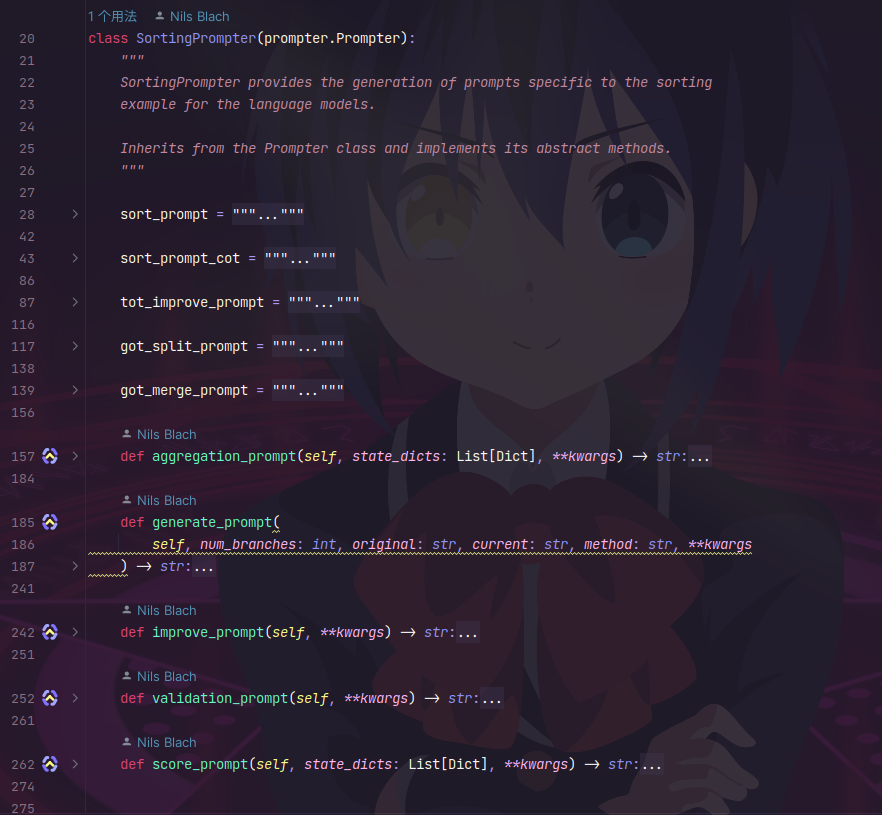

prompt生成器继承于`Prompter`，需要重写里面的一些方法，其主要作用为结合一些人工设定好的prompt模板，以及图节点，生成输入到模型中的prompt

**Parser：**同上，但是将模型返回值进行一些处理


##### 1.2.2.3 思维树思维图比较

**思维树**是简单的线性结构，当需要处理的问题比较复杂的时候，无法很好的完成任务（无法以全局的思维来思考问题，思维树的branch之间无法进行交互）

**思维图**将模型的思考过程构建成一个复杂的图结构，图中的思维可以互相交汇、融合

#### 1.2.3 LLM多模态现有研究

现在的多模态大语言模型基本上都是将文字以及图片作为输入，之后生成图片或者对生成对图片的介绍，**而我们的最终任务是将声音、图片以及身体指标作为输入输入到大语言模型中**

##### 1.2.3.1 [A Survey on Multimodal Large Language Models](https://arxiv.org/pdf/2306.13549.pdf)

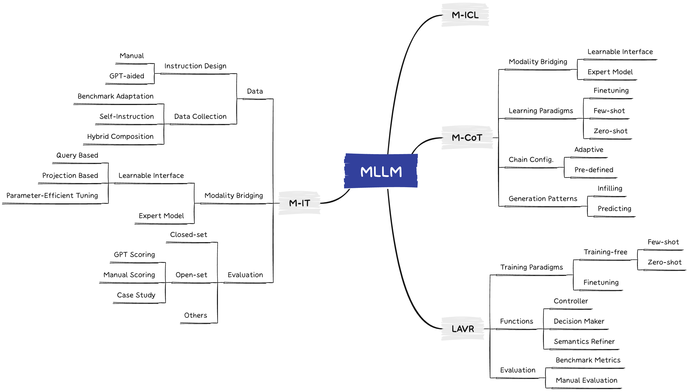

这篇文章主要探讨了如何将将**LLM**作为大脑，处理多模态输入的方法，而其方法主要如下：

**・多模态指令微调（Multimodal Instruction Tuning）**

**・多模态上下文学习（Multimodal In-Context Learning）**

**・多模态思维链（Multimodal Chain-of-Thought）**

**・LLM 辅助的视觉推理（LLM-Aided Visual Reasoning）**

以上的思路，都是在微调或者使用prompt的时候将非文本信息输入，而其微调以及prompt思路与平常无异


##### 1.2.3.2 [Video-LLaMA: An Instruction-tuned Audio-Visual Language Model for Video Understanding](https://arxiv.org/abs/2306.02858)

这篇论文将视频输入输入到大语言模型当中，将视频流和声音流分离并输入到模型中

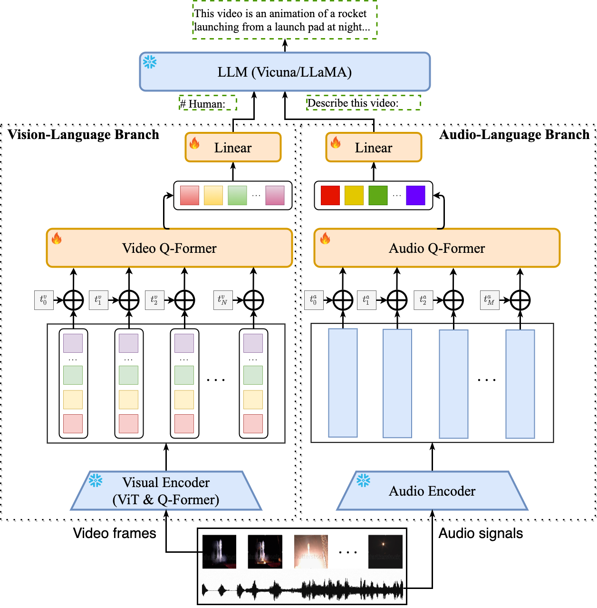


##### 1.2.3.3 [Visual Instruction Tuning-LLaVA: Large Language and Vision Assistant](https://llava-vl.github.io/)

也是在gpt的基础上增加了视觉编码层，将视觉信息输入到大语言模型中去

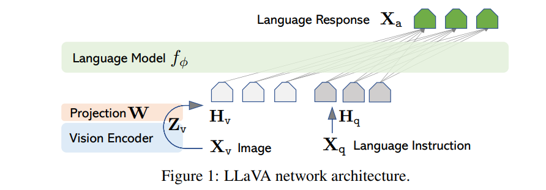


#### 1.2.4 心理学方面调研（人类医生如何判断心理疾病、如何判断心理疾病类型）

先以抑郁症为例

如今医生判断用户是否患有抑郁症通常流程如下：

初步评估 -> 详细评估 -> 诊断 -> 制定治疗计划 -> 治疗以及干预 -> 更进并评估 -> 终止治疗

似乎现在并没有一个范式，来判断患者是否患有抑郁症，抑郁症的程度

抑郁症问卷：

现在抑郁症的问卷的主流形式为：**做选择题之后给每道题打分，按照分数的多少判断用户是否患有抑郁症**

- **[汉密尔顿抑郁量表（Hamilton Depression Rating Scale，HDRS）](https://med.stanford.edu/fastlab/research/imapp/msrs/_jcr_content/main/accordion/accordion_content3/download_256324296/file.res/PHQ9%20id%20date%2008.03.pdf)**
- [**病人健康问卷-9（Patient Health Questionnaire-9，PHQ-9）**](https://med.stanford.edu/fastlab/research/imapp/msrs/_jcr_content/main/accordion/accordion_content3/download_256324296/file.res/PHQ9%20id%20date%2008.03.pdf)
- **贝克抑郁自评量表（Beck Depression Inventory，BDI）**


### 1.3 技术可行性

#### 1.3.1 数据可行性

##### 1.3.1.1 **[DAIC-WOZ数据集](https://dcapswoz.ict.usc.edu/)**:

这个数据集包含了189为志愿者与心里医生的多轮对话，包含：**语音、文字、图片等信息**


##### 1.3.1.2 情感分析数据集**[AVEC 2013 && AVEC 2014](http://www.cs.nott.ac.uk/~pszmv/Documents/avec2014.pdf)**

这个数据集包含video文件以及面部表情等图片以及点坐标文件，但是数据集的目的**并不是做抑郁症检查，而是情感分析**


##### 1.3.1.3 **CLEF/eRsik 2017**

该数据集由887个Reddit用户组成，分为抑郁症患者(positive)和正常人(negative)两类。

每个用户的文本按时间顺序排列，并被分成10个chunk。其中chunk1包括最旧的10％的消息，chunk2包括第二个最旧的10％的信息，依此类推。


##### 1.3.1.4 **CLEF/eRisk 2017数据集**

1. **数据类型：** CLEF/eRisk 2017数据集是一个文本数据集，包括来自互联网的社交媒体帖子和用户生成的内容，如博客、评论和论坛帖子。这些数据反映了个体在互联网上的言辞和信息发布。
2. **任务：** CLEF/eRisk 2017的主要任务是早期健康风险预测。具体来说，任务是识别互联网用户的心理健康问题风险，例如，是否存在抑郁症、焦虑症等。这个任务旨在帮助早期识别潜在的心理健康问题，以便采取适当的干预措施。
3. **情感和主题标签：** 数据集中的文本数据已经被标记，其中包括了有关情感状态（如情感积极性和消极性）以及主题（如自杀、抑郁、焦虑等）的信息。这些标签可用于帮助模型识别潜在的健康风险。
4. **数据来源：** 数据集中的文本数据是从互联网上收集的，包括社交媒体平台、在线论坛、博客等。这些数据反映了真实世界中的用户生成内容。
5. **研究用途：** CLEF/eRisk 2017数据集可用于开展早期健康风险预测的研究，特别是在互联网上的预测。研究人员可以使用这些数据来开发文本分析和自然语言处理模型，以识别潜在的心理健康问题和风险因素。


##### 1.3.1.5 **[Reddit Self-reported Depression Diagnosis (RSDD) dataset](https://georgetown-ir-lab.github.io/emnlp17-depression/)**

这个数据集包含的是文本信息，其中是一个网站上全部声称自己患有抑郁症发的贴子

**可以看出，相关的数据集还是很多的，但是并不是全部的数据集都能完美契合与我们的目标，在之后需要增加prompt提示词的时候可能需要参考心理医生的一些判断理论，甚至构建知识图谱来增强模型的推理能力，而这些数据集现在很少使用在大预言模型上面**


#### 1.3.2 LLM选择与构建可行性

##### 1.3.2.1 调用ChatGPT的API

**优势：**

生态比较完整

可以使用**langchain**构建自己的数据库，从而增加LLM的知识

**劣势：**

- 很难微调模型
- 基本上不可能改变模型结构（后续多模态输入可能比较难）


##### 1.3.2.2 本地部署LLM

**先使用ChatGPT API，需要调整模型参数以及结构再考虑本地搭建**

（也会本地搭建LLM环境，练习使用）

###### **LLaMA-2**


#### 1.3.3 大模型多模态输入可行性

**后续涉及此部分再进行调研**


## 二、计划以及实验内容

### 2.1  思维图学习以及复现

#### 2.1.1 任务1：思维图复现，并在工程和思路两个维度上面进行复现

将排序变成两个排序，分为偶数排序和奇数排序，

1. 变成两个任务，偶数拍好后奇数排序，再合并

   - 数列1,2,3,4,5

   - [1,3,5]

   - [2,4]

   - 合并

2. 整个在一起里面去做，实现奇数偶数的分类，在排序

   - 数列1,2,3,4,5

   - [1,3,5,2,4]

   - 排序

3. ***对比***：**时间**、**准确率**、**输入数列的长度**、**输入数列的均衡性**、**输入的离散性**

4. 心理学问卷，回答A~D，会更具选项跳到制定部分（树结构），改变成图结构

##### 2.1.1.1 **实验：**将列表分为奇数列表和偶数列表，再细分之后排序合并

###### **GoO设计（先不涉及多轮输出以及打分）：**

这一部分是全部关于思维图中GoO的设计

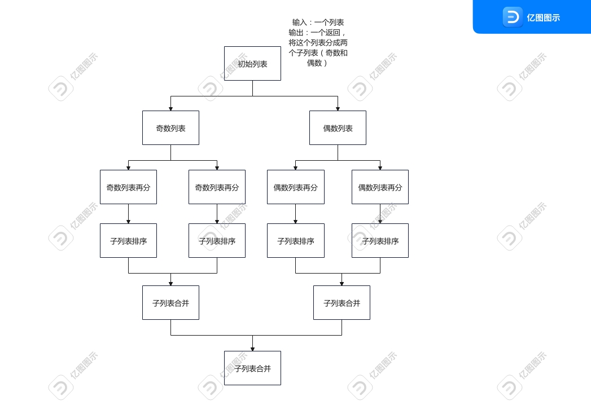

```python
def got():
    operations_graph = operations.GraphOfOperations()
    plans = operations.Generate(1, 1)
    operations_graph.append_operation(plans)
    sort_list = []
    k = 0
    # 将初始列表分为奇数和偶数
    for i in ["odd", "even"]:
        list_type_odd_even = f"List {i}"
        # 增加prompter选择器，选出奇数以及偶数的输出
        sub_list_odd_even = operations.Selector(
            lambda thoughts, list_id=list_type_odd_even: [
                thought for thought in thoughts if thought.state["part"] == list_id
            ]
        )
        # 将生成的prompt分开并且添加到根节点上
        sub_list_odd_even.add_predecessor(plans)
        operations_graph.add_operation(sub_list_odd_even)
        generate_sublist = operations.Generate(1, 1)
        generate_sublist.add_predecessor(sub_list_odd_even)
        operations_graph.add_operation(generate_sublist)

        # 分别将奇数、偶数的列表再分成两个子列表
        for j in range(1, 3):
            list_type = f"List {j}"
            # 增加prompter选择器，选出再次拆分的
            sub_list = operations.Selector(
                lambda thoughts, list_id=list_type: [
                    thought for thought in thoughts if thought.state["part"] == list_id
                ]
            )
            # 给当前子列表排序
            sub_list.add_predecessor(generate_sublist)
            operations_graph.add_operation(sub_list)
            sort_sub_list = operations.Generate(1, 1)
            sort_sub_list.add_predecessor(sub_list)
            operations_graph.add_operation(sort_sub_list)

            sort_list.append(sort_sub_list)

    # 合并子列表
    aggregate_1 = operations.Aggregate(1)
    aggregate_1.add_predecessor(sort_list[0])
    aggregate_1.add_predecessor(sort_list[1])
    operations_graph.add_operation(aggregate_1)
    # 合并子列表
    aggregate_2 = operations.Aggregate(1)
    aggregate_2.add_predecessor(sort_list[2])
    aggregate_2.add_predecessor(sort_list[3])
    operations_graph.add_operation(aggregate_2)
    # 合并合并后的子列表
    final_aggregate = operations.Aggregate(1)
    operations_graph.append_operation(final_aggregate)

    return operations_graph
```


###### **Prompter：**

这一部分是关于Prompter的设计

```python
class SortPrompter(prompter.Prompter):
    def __init__(self):
        # 将当前数组按照奇数偶数分离
        self.split_even_odd_prompt = """
        <Instruction> 
        Split the following list of 32 numbers into 2 lists, the first list should contain all the odd numbers, the second list should contain all the even numbers.
        Only output the final 2 lists in the following format without any additional text or thoughts!:
        {{
            "List odd": [3, 3, 5, 7, 1, ...],
            "List even": [2, 2, 4, 8, ...],
        }} 
        </Instruction>
        
        <Example>
        Input: [3, 1, 9, 3, 7, 5, 5, 4, 8, 1, 5, 3, 3, 2, 3, 0, 9, 7, 2, 2, 4, 4, 8, 5, 0, 8, 7, 3, 3, 8, 7, 0]
        Output: 
        {{
            "List odd": [3, 1, 9, 3, 7, 5, 5, 1, 5, 3, 3, 3, 9, 7, 5, 7, 3, 3, 7],
            "List even": [4, 8, 2, 0, 2, 2, 4, 4, 8, 0, 8, 8, 0]
        }}
        </Example>
        
        Input: {input}
        """
		
        # 将当前列表按照顺序分成两个列表
        self.split_prompt = """
        <Instruction> 
        Split the following list of {length} numbers into 2 lists, the first list should contain the first half of numbers, the second list contain the other numbers.
        Only output the final 2 lists in the following format without any additional text or thoughts!:
        {{
            "List 1": [3, 4, 3, 5, 7, 8, 1, ...],
            "List 2": [2, 9, 2, 4, 7, 1, 5, ...],
        }} 
        </Instruction>
        
        <Example>
        Input: [3, 1, 9, 3, 7, 5, 5, 4, 8, 1, 5, 3, 3, 2, 3, 0, 9, 7, 2, 2, 4, 4, 8, 5, 0, 8, 7, 3, 3, 8, 7, 0, 9, 5, 1, 6, 7, 6, 8, 9, 0, 3, 0, 6, 3, 4, 8, 0, 6, 9, 8, 4, 1, 2, 9, 0, 4, 8, 8, 9, 9, 8, 5, 9]
        Output: 
        {{
            "List 1": [3, 1, 9, 3, 7, 5, 5, 4, 8, 1, 5, 3, 3, 2, 3, 0, 9, 7, 2, 2, 4, 4, 8, 5, 0, 8, 7, 3, 3, 8, 7, 0],
            "List 2": [9, 5, 1, 6, 7, 6, 8, 9, 0, 3, 0, 6, 3, 4, 8, 0, 6, 9, 8, 4, 1, 2, 9, 0, 4, 8, 8, 9, 9, 8, 5, 9]
        }}
        </Example>
        
        Input: {input}
        """

        # 排序当前列表
        self.sort_prompt = """
        <Instruction> 
        Sort the following list of numbers in ascending order. Output only the sorted list of numbers, no additional text. 
        </Instruction>

        <Examples>
        Input: [5, 1, 0, 1, 2, 0, 4, 8, 1, 9, 5, 1, 3, 3, 9, 7]
        Output: [0, 0, 1, 1, 1, 1, 2, 3, 3, 4, 5, 5, 7, 8, 9, 9]
        
        Input: [3, 7, 0, 2, 8, 1, 2, 2, 2, 4, 7, 8, 5, 5, 3, 9, 4, 3, 5, 6, 6, 4, 4, 5, 2, 0, 9, 3, 3, 9, 2, 1]
        Output: [0, 0, 1, 1, 2, 2, 2, 2, 2, 2, 3, 3, 3, 3, 3, 4, 4, 4, 4, 5, 5, 5, 5, 6, 6, 7, 7, 8, 8, 9, 9, 9]
        
        Input: [4, 4, 9, 7, 9, 7, 0, 0, 4, 9, 1, 7, 9, 5, 8, 7, 5, 6, 3, 8, 6, 7, 5, 8, 5, 0, 6, 3, 7, 0, 5, 3, 7, 5, 2, 4, 4, 9, 0, 7, 8, 2, 7, 7, 7, 2, 1, 3, 9, 9, 7, 9, 6, 6, 4, 5, 4, 2, 0, 8, 9, 0, 2, 2]
        Output: [0, 0, 0, 0, 0, 0, 0, 1, 1, 2, 2, 2, 2, 2, 2, 3, 3, 3, 3, 4, 4, 4, 4, 4, 4, 4, 5, 5, 5, 5, 5, 5, 5, 6, 6, 6, 6, 6, 7, 7, 7, 7, 7, 7, 7, 7, 7, 7, 7, 7, 8, 8, 8, 8, 8, 9, 9, 9, 9, 9, 9, 9, 9, 9]
        </Examples>
        
        Input: {input}
        """

        # 按照归并排序的合并方式合并两个列表
        self.merge_prompt = """
        <Instruction> 
        Merge the following 2 sorted lists of length {length1} and {length2} each, into one sorted list of length {length} using a merge sort style approach.
        Only output the final merged list without any additional text or thoughts!:
        </Instruction>
        
        <Approach>
        To merge the two lists in a merge-sort style approach, follow these steps:
        1. Compare the first element of both lists.
        2. Append the smaller element to the merged list and move to the next element in the list from which the smaller element came.
        3. Repeat steps 1 and 2 until one of the lists is empty.
        4. Append the remaining elements of the non-empty list to the merged list.
        </Approach>
        
        Merge the following two lists into one sorted list:
        1: {input1}
        2: {input2}
        
        Merged list:
        """

    # 合并两个数组的prompt生成器，其中输入state_dicts包含了两个thought
    def aggregation_prompt(self, state_dicts: List[Dict], **kwargs) -> str:
        assert len(state_dicts) == 2, "Expected two states for aggregation prompt."
        len_input1 = len(string_to_list(state_dicts[0]["current"]))
        len_input2 = len(string_to_list(state_dicts[1]["current"]))

        return self.merge_prompt.format(
            input1=state_dicts[0]["current"],
            input2=state_dicts[1]["current"],
            length1=len_input1,
            length2=len_input2,
            length=len_input1 + len_input2,
        )


